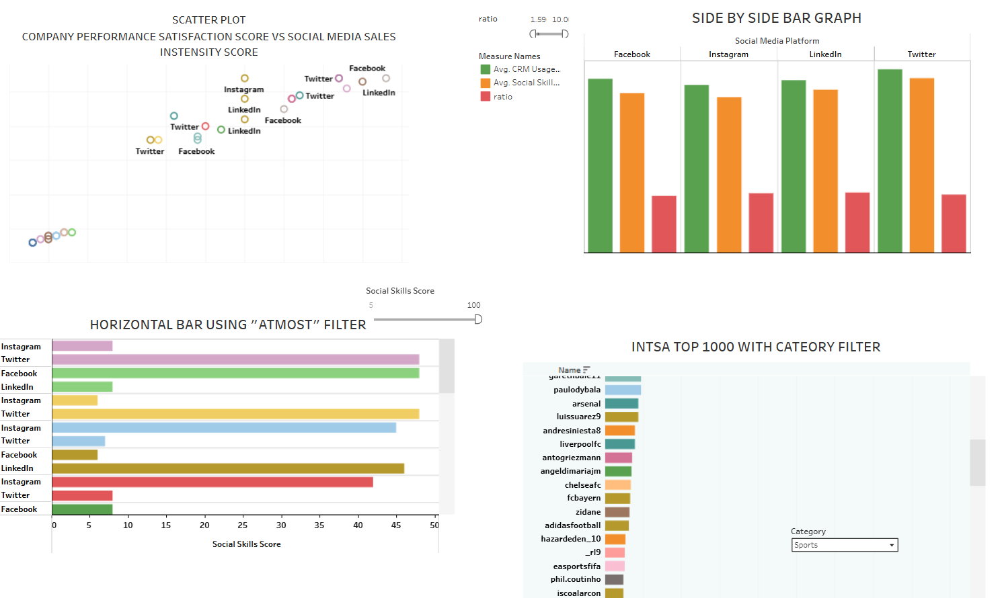

# 📈 Social Media Analysis Dashboard - Soujanya Upase

This project features a self-driven Tableau dashboard analyzing **social media engagement data** across platforms.

🔗 **[View Interactive Dashboard on Tableau Public](https://public.tableau.com/app/profile/soujanya.upase/viz/SOCIALMEDIAANALYSIS-SOUJANYAUPASE/SOCIALMEDIAANALYSIS?publish=yes)**

---

## 📊 About the Dashboard

This dashboard was created to analyze how different types of content perform across multiple social platforms.  
It aims to answer key business questions like:

- What type of content drives the most engagement?
- Which platform performs best over time?
- How does timing affect user interactions?

---

## 📌 Features
- 🧮 Engagement metrics by platform and content type
- 📆 Time trend analysis
- 📊 Dynamic filters for deep dives
- 🌈 Visual storytelling through intuitive chart types

---

## 🛠️ Tools Used
- **Tableau Public**
- **CSV / Excel for raw data**
- **GitHub for documentation**

---

## 💡 Key Insights
- Peak posting times with best engagement
- Most engaging content categories
- Platform-specific performance patterns

---
